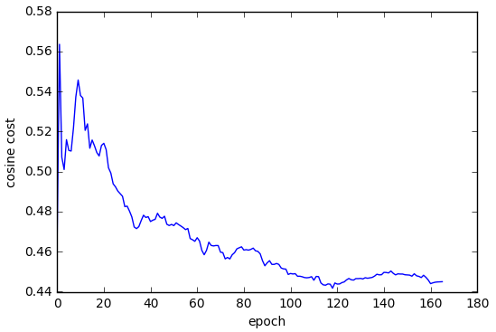
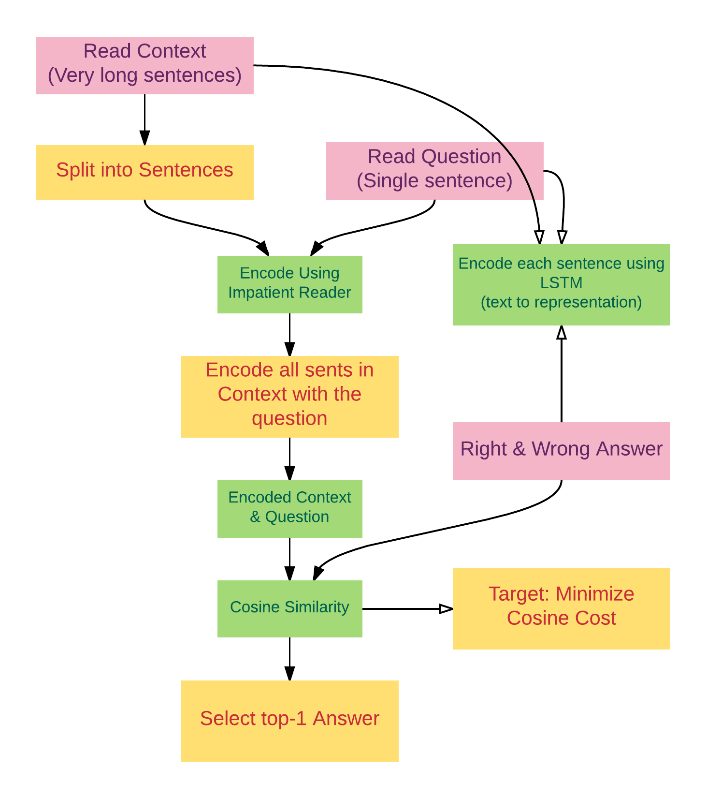

# Description

[Failed project, but you can read furthur for why]. Read articles and make multiple choices now can be done with machine. The project consists of two models. The impatient reader model in [1] comprehends very long articles and a related question. A cosine similarity cost model from [5] to choose best answer from four options. I implemented the model in [TensorFlow](https://github.com/tensorflow/tensorflow). Both used GRU cell for deep RNNs.

The training set consists of a context, a question, and four multiple choices, with only one of them is true. Context was splitted into sentences, embedded into a vector with the question. The embedded vector and choices are later calculated using cosine similarity. The non-supervisual target is to minimize cosine cost.

Instead of simply solving [cloze-like questions](https://en.wikipedia.org/wiki/Cloze_test), the model can comprehend both article and a related question, and choose the best answer from a list of candidates. But the project compared to real research project like [bidirectional attetion flow for machine comprehension](https://arxiv.org/pdf/1611.01603v3.pdf), we lack the deep-lstm decoder, and we lack word embeddings (they have over 400x400 vectors for each word, we have 400xn cells for a sentence!), and we only used one encoder for context and question while they have two (from context to question, and from question to context).

```shell
python3 train.py # 2.7 goes well too
python3 test.py
```
# Train Set

```
{
    "answer": 3, 
    "question": "The Basilica of the Sacred heart at Notre Dame is beside to which structure?", 
    "answer_list": [
        "a copper statue of Christ", 
        "a golden statue of the Virgin Mary", 
        "Saint Bernadette Soubirous", 
        "the Main Building"
    ], 
    "context": "Architecturally, the school has a Catholic character. Atop the Main Building's gold dome is a golden statue of the Virgin Mary. Immediately in front of the Main Building and facing it, is a copper statue of Christ with arms upraised with the legend \"Venite Ad Me Omnes\". Next to the Main Building is the Basilica of the Sacred Heart. Immediately behind the basilica is the Grotto, a Marian place of prayer and reflection. It is a replica of the grotto at Lourdes, France where the Virgin Mary reputedly appeared to Saint Bernadette Soubirous in 1858. At the end of the main drive (and in a direct line that connects through 3 statues and the Gold Dome), is a simple, modern stone statue of Mary."
}
```

# Similar Works

- [AllienAI](https://github.com/tambetm/allenAI), the problem they solved did not have a context.
- [Attentive Reader(tensorflow)](https://github.com/carpedm20/attentive-reader-tensorflow), the problem they solved was cloze-like, the project is deprecated.

# Evaluation

Trained with default setups and best achieved 35% correct rate. This didn't overperform even [Logistic Regression Baseline](https://rajpurkar.github.io/SQuAD-explorer/) which scores 40.4% correct rate. I wasn't aware of the state-of-art models until I finished this project. The problem for our project is that we encoded sentences instead of with finer grains (usually are word-level). And I think cosine similarity is too simple for classification, since even the logistic regression baseline used 180 million features, which is hard to imagine can be handled by a shallow model.



# References

1. [DeepMind: Teaching Machines to Read and Comprehend](https://github.com/thomasmesnard/DeepMind-Teaching-Machines-to-Read-and-Comprehend) (*)
2. [Teaching Machines to Read and Comprehend (blog)](http://rsarxiv.github.io/2016/06/13/Teaching-Machines-to-Read-and-Comprehend-PaperWeekly/)
3. [Implementing A Cnn for Text Classfication in Tensorflow](http://www.wildml.com/2015/12/implementing-a-cnn-for-text-classification-in-tensorflow/)
4. [Deep Learning for Answer Sentence Selection](http://ttic.uchicago.edu/~haotang/speech/1412.1632v1.pdf) (*)
5. [LSTM-Based Deep Learning Models For Nonfactoid Answer Selection](https://arxiv.org/pdf/1511.04108v4.pdf) (*)
6. [Official Tensorflow Tutorials](https://www.tensorflow.org/versions/r0.12/tutorials/index.html)
7. [Tensorflow Doc(中文)](http://wiki.jikexueyuan.com/project/tensorflow-zh/get_started/basic_usage.html)

# Design


